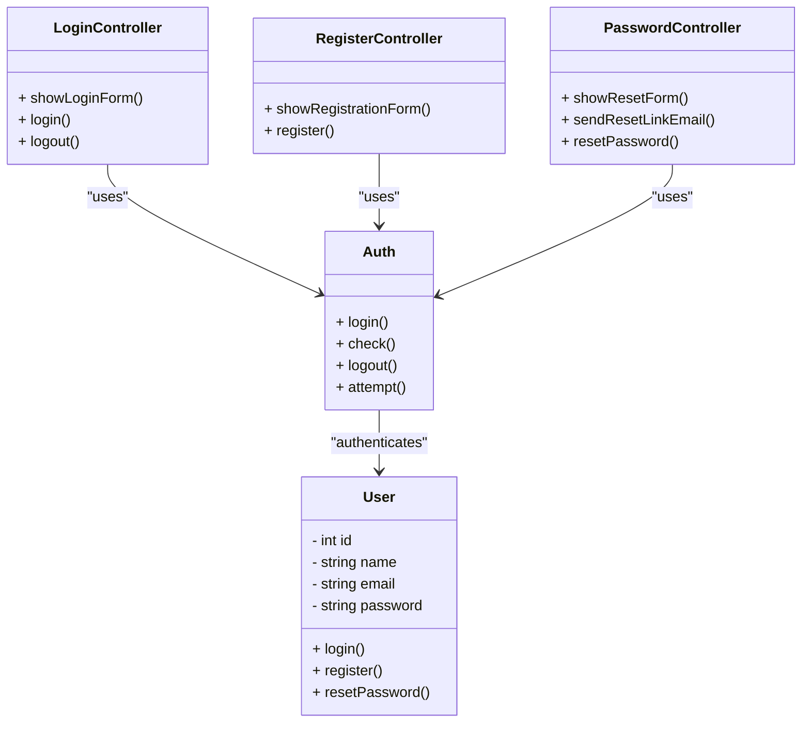

```mermaid
classDiagram
    class User {
        - int id
        - string name
        - string email
        - string password
        + login()
        + register()
        + resetPassword()
    }

    class Auth {
        + login()
        + check()
        + logout()
        + attempt()
    }

    class LoginController {
        + showLoginForm()
        + login()
        + logout()
    }

    class RegisterController {
        + showRegistrationForm()
        + register()
    }

    class PasswordController {
        + showResetForm()
        + sendResetLinkEmail()
        + resetPassword()
    }

    Auth --> User : "authenticates"
    LoginController --> Auth : "uses"
    RegisterController --> Auth : "uses"
    PasswordController --> Auth : "uses"


```