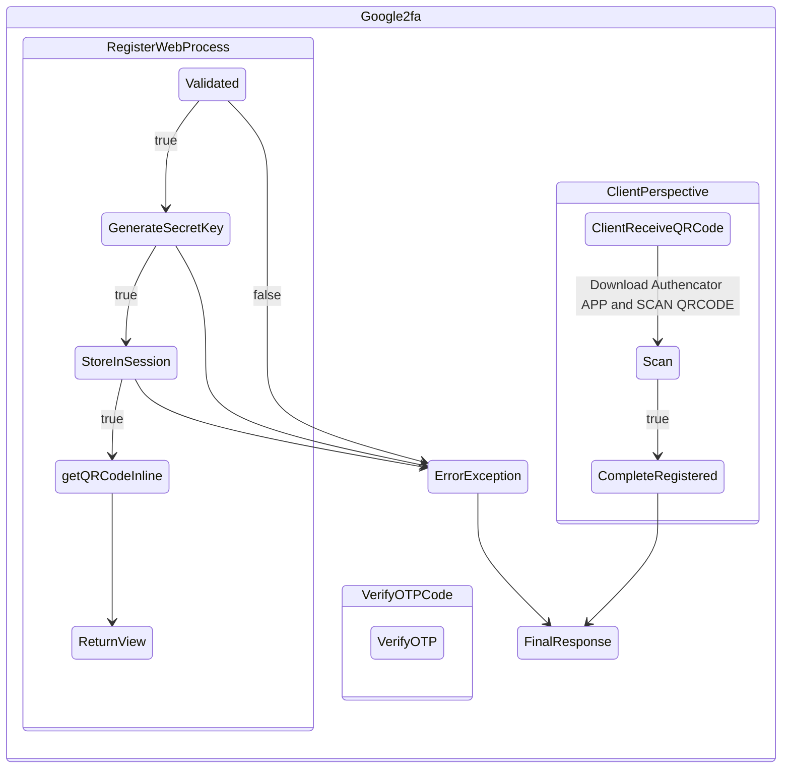

```mermaid
    stateDiagram
    state Google2fa {
        ErrorException
        FinalResponse
        RegisterWebProcess
        ClientPerspective
        VerifyOTPCode
    }

    state RegisterWebProcess {
        Validated
        Validated --> GenerateSecretKey : true
        GenerateSecretKey --> StoreInSession : true
        StoreInSession --> getQRCodeInline : true
        getQRCodeInline --> ReturnView
    }
    Validated --> ErrorException : false
    GenerateSecretKey --> ErrorException
    StoreInSession --> ErrorException
    ErrorException --> FinalResponse

    state ClientPerspective {
        ClientReceiveQRCode --> Scan : Download Authencator APP and SCAN QRCODE
        Scan --> CompleteRegistered : true
    }
    CompleteRegistered --> FinalResponse

    state VerifyOTPCode {
        VerifyOTP
    }


```