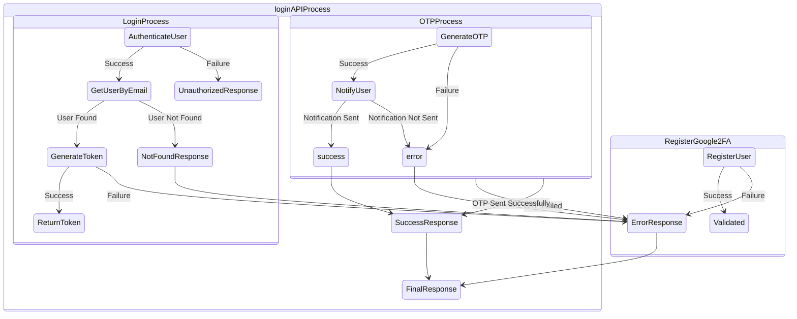

```mermaid
    stateDiagram
    state LoginProcess {
        AuthenticateUser
        AuthenticateUser --> GetUserByEmail : Success
        AuthenticateUser --> UnauthorizedResponse : Failure
        GetUserByEmail --> GenerateToken : User Found
        GenerateToken --> ReturnToken : Success
        GetUserByEmail --> NotFoundResponse : User Not Found
        NotFoundResponse --> ErrorResponse
    }
    GenerateToken --> ErrorResponse : Failure

    state OTPProcess {
        GenerateOTP
        GenerateOTP --> NotifyUser : Success
        GenerateOTP --> error : Failure
        NotifyUser --> success : Notification Sent
        NotifyUser --> error : Notification Not Sent
        error --> ErrorResponse
        success --> SuccessResponse
    }

    state loginAPIProcess {
        LoginProcess
        OTPProcess

        ErrorResponse
        SuccessResponse

        OTPProcess --> ErrorResponse : OTP Failed
        OTPProcess --> SuccessResponse : OTP Sent Successfully

        ErrorResponse --> FinalResponse
        SuccessResponse --> FinalResponse
    }

    state RegisterGoogle2FA {
        RegisterUser
        RegisterUser --> Validated : Success
        RegisterUser --> ErrorResponse : Failure
    }


```