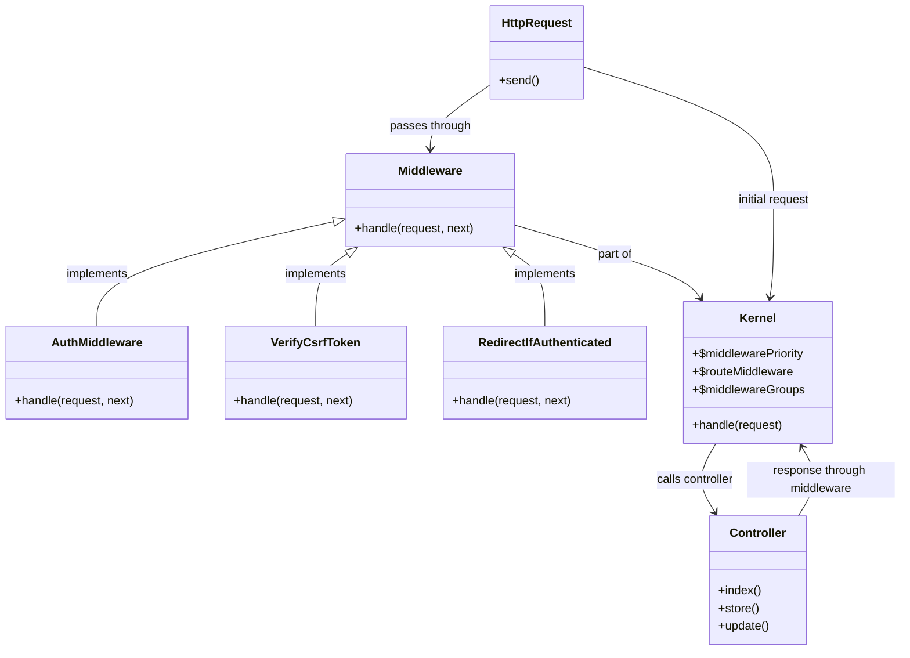

```mermaid
classDiagram
    class HttpRequest {
        +send()
    }

    class Middleware {
        +handle(request, next)
    }

    class Kernel {
        +$middlewarePriority
        +$routeMiddleware
        +$middlewareGroups
        +handle(request)
    }

    class AuthMiddleware {
        +handle(request, next)
    }

    class VerifyCsrfToken {
        +handle(request, next)
    }

    class RedirectIfAuthenticated {
        +handle(request, next)
    }

    class Controller {
        +index()
        +store()
        +update()
    }

    HttpRequest --> Middleware : passes through
    Middleware <|-- AuthMiddleware : implements
    Middleware <|-- VerifyCsrfToken : implements
    Middleware <|-- RedirectIfAuthenticated : implements
    Middleware --> Kernel : part of
    Kernel --> Controller : calls controller
    HttpRequest --> Kernel : initial request
    Controller --> Kernel : response through middleware


```